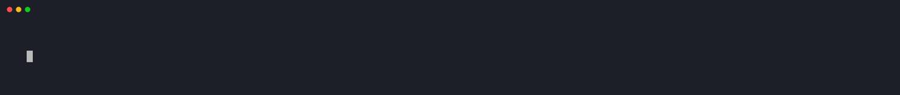

# vibeline

> An emoji-first statusline for Claude Code that shows your session's mood.

[](https://github.com/zeroblack/vibeline/actions/workflows/shellcheck.yml)
[](LICENSE)

Instead of a flat clock ticking up, watch your session evolve:
🌱 fresh start → ☕ warmed up → 🔥 in flow → 🚀 launched → 💪 strong → 🧙 wizard hours → 🧟 zombie → 👻 past midnight.



## Why

Existing statuslines tell you facts. vibeline tells you how the session feels.

It's emoji-first on purpose, built for the long sessions — the kind where you forget what time it is. It keeps you connected to the session and to your own sense of time and space without asking you to read a single number.

I made it for me. If it's useful to you too, even better.

## What you see

Two lines — identity on top, metrics below. Long session names never push anything off-screen.

**Line 1 — where you are**

- 🧠 **model** — Opus, 🎵 Sonnet, or 🍃 Haiku
- 📁 **location** — current folder + git branch, dirty file count, ahead/behind
- 💬 **session name** — whatever Claude Code has named this session

**Line 2 — how it's going**

- 🎯 **tasks** — pending/in-progress/done for the current session's `TodoWrite` list (`1⚙ 2✓`). Falls back to 📋 code markers (`TODO / FIXME / XXX / HACK`) when no session tasks exist
- 🚀 **elapsed** — how long you've been at it, with an emoji that evolves every stage
- 💰 **cost** — session spend, colored by tier. ⚡ flashes when it grows
- 🌊 **plan usage** — session bar (🌊→🌀→🌪→⛈️) and weekly bar (🌑→🌒→🌓→🌔→🌕) against your Max/Pro quota. Approximate, needs calibration per plan
- 🟢 **context** — 5-dot usage bar for the context window
- 🌆 **clock** — wall time, with a different icon for dawn / day / evening / night

## Install

**1.** Download the script:

```bash
curl -fsSL https://raw.githubusercontent.com/zeroblack/vibeline/main/install.sh | bash
```

This pulls `statusline.sh` into `~/.claude/`, makes it executable, and asks if you want to register it automatically.

If you prefer to do it yourself:

```bash
curl -fsSL https://raw.githubusercontent.com/zeroblack/vibeline/main/statusline.sh -o ~/.claude/statusline.sh
chmod +x ~/.claude/statusline.sh
```

**2.** Register it in `~/.claude/settings.json`:

```json
{
  "statusLine": {
    "type": "command",
    "command": "/bin/bash ~/.claude/statusline.sh"
  }
}
```

**3.** Restart Claude Code. That's it.

### On Claude Max or Pro?

Your session "cost" is theoretical (you pay a subscription, not per token). Add `CCSL_PLAN=max` so the number shows as `~$2.45` to signal it:

```json
"command": "CCSL_PLAN=max /bin/bash ~/.claude/statusline.sh"
```

The plan also unlocks the **usage bars** — a wave for your current 5h session and a moon phase for the week. Values in `CCSL_PLAN`: `pro`, `max` (Max 5x), `max20` (Max 20x). If your numbers don't match Claude Code's own `/usage` screen, calibrate them:

1. Open `/usage` in Claude Code, note the session and weekly percentages
2. Compare to what vibeline shows (e.g. vibeline says `~67%`, `/usage` says `53%`)
3. Look up the raw tokens vibeline has measured: `cat ~/.claude/cache/statusline/usage`
4. Compute the real quota for your plan: `quota = tokens ÷ (real_pct / 100)`
5. Lock it in with:
   ```json
   "command": "CCSL_PLAN=max20 CCSL_SESSION_QUOTA_TOKENS=1000000000 CCSL_WEEK_QUOTA_TOKENS=6500000000 /bin/bash ~/.claude/statusline.sh"
   ```

Anthropic doesn't publish exact quotas, so the defaults are best-guess and the bars are marked `~` to signal they're approximate.

## Customize

Every option is an environment variable — you set them by prepending them to the `command` string in `settings.json`. No config file.

### Recipes

**Hide cost and clock** (privacy-friendly):

```json
"command": "CCSL_SHOW_COST=0 CCSL_SHOW_CLOCK=0 /bin/bash ~/.claude/statusline.sh"
```

**Minimal** — just model, folder, git, context bar:

```json
"command": "CCSL_SHOW_TODOS=0 CCSL_SHOW_SESSION_NAME=0 CCSL_SHOW_ELAPSED=0 CCSL_SHOW_COST=0 CCSL_SHOW_CLOCK=0 /bin/bash ~/.claude/statusline.sh"
```

**Track custom keywords** — add `OPTIMIZE` and `REVIEW` alongside the defaults:

```json
"command": "CCSL_TODO_PATTERN='(TODO|FIXME|XXX|HACK|OPTIMIZE|REVIEW)' /bin/bash ~/.claude/statusline.sh"
```

### All variables

Set any of these to `0` to hide that segment. Leave them alone to keep the default layout.

| Variable | Default | What it controls |
|---|---|---|
| `CCSL_SHOW_COST` | `1` | 💰 cost segment |
| `CCSL_SHOW_ACTIVITY` | `1` | ⚡ flash on cost growth |
| `CCSL_SHOW_TODOS` | `1` | 📋 TODO counter |
| `CCSL_SHOW_SESSION_NAME` | `1` | 💬 session name |
| `CCSL_SHOW_ELAPSED` | `1` | evolving time emoji |
| `CCSL_SHOW_CONTEXT` | `1` | context usage bar |
| `CCSL_SHOW_CLOCK` | `1` | wall clock |
| `CCSL_SHOW_USAGE` | `1` | 🌊 plan usage bars (session + week) |
| `CCSL_PLAN` | `api` | `pro`, `max`, or `max20` — unlocks cost prefix and usage bars |
| `CCSL_SESSION_QUOTA_TOKENS` | auto | override 5h session token quota (calibrate vs `/usage`) |
| `CCSL_WEEK_QUOTA_TOKENS` | auto | override weekly token quota |
| `CCSL_USAGE_TTL` | `60` | seconds to cache usage aggregation |
| `CCSL_TODO_PATTERN` | `(TODO\|FIXME\|XXX\|HACK)` | regex of keywords to count |
| `CCSL_TODO_TTL` | `60` | seconds to cache code marker count |
| `CCSL_TASK_TTL` | `15` | seconds to cache session task read |
| `CCSL_ACTIVITY_LINGER` | `3` | seconds ⚡ stays visible |
| `CCSL_CACHE_DIR` | `~/.claude/cache/statusline` | cache location |
| `CCSL_SESSIONS_DIR` | `~/.claude/sessions` | Claude Code session store |
| `CCSL_PROJECTS_DIR` | `~/.claude/projects` | Claude Code projects store (read for token aggregation) |

The model, folder, and git branch segments always show when relevant — they anchor line 1. If every variable on line 2 is set to `0`, the second line disappears and you get a single-line statusline.

## Elapsed time progression

| Range | Emoji | |
|---|---|---|
| < 15m | 🌱 | fresh start |
| 15m – 45m | ☕ | warmed up |
| 45m – 90m | 🔥 | in flow |
| 1.5h – 3h | 🚀 | launched |
| 3h – 4h | ⚡ | charged |
| 4h – 5h | 💪 | strong |
| 5h – 6h | 🦾 | bionic |
| 6h – 8h | 🌋 | erupting |
| 8h – 10h | 🧙 | wizard hours |
| 10h – 12h | 🦉 | night owl |
| 12h – 16h | 🧟 | zombie |
| 16h – 20h | 💀 | skull |
| 20h – 24h | ☠️ | danger zone |
| > 24h | 👻 | ghost |

## Requirements

- `bash` 3.2+
- `jq`
- `awk`
- `git` (optional, only for branch and TODO segments)
- A terminal with emoji support

Tested on macOS and Linux. Works inside Claude Code's TUI, iTerm2, WezTerm, Alacritty, and Kitty.

## Uninstall

```bash
rm ~/.claude/statusline.sh
rm -rf ~/.claude/cache/statusline
```

Then remove the `statusLine` key from `~/.claude/settings.json`.

## Usage bar progression

| Session (5h) | | Week (7d) | |
|---|---|---|---|
| < 50% | 🌊 calm | < 25% | 🌑 new moon |
| 50 – 75% | 🌀 riptide | 25 – 50% | 🌒 waxing crescent |
| 75 – 90% | 🌪 cyclone | 50 – 75% | 🌓 first quarter |
| ≥ 90% | ⛈️ storm | 75 – 90% | 🌔 waxing gibbous |
|  |  | ≥ 90% | 🌕 full moon |

## Why not ccstatusline?

[ccstatusline](https://github.com/sirmalloc/ccstatusline) is excellent and fully configurable. vibeline is a different take:

- **Emoji as vocabulary, not decoration** — every icon names its category, and the category has a progression (session evolves 🌱→☕→🔥→🧙, the plan usage evolves 🌊→🌀→🌪→⛈️, the week fills like the moon 🌑→🌒→🌓→🌕)
- **Progression over counters** — a 3-hour session should *feel* different than a 30-minute one, even before you read the number
- **Zero config** — one Bash file, no npm chain, no runtime beyond what every dev machine already has

Use ccstatusline if you want every possible number on screen. Use vibeline if you want one that tells you how long you've been at it with a 🧙 or a 🧟.

## Contributing

See [CONTRIBUTING.md](CONTRIBUTING.md).

## Credits

Token-window aggregation over local JSONL was inspired by [ccusage](https://github.com/ryoppippi/ccusage) by [@ryoppippi](https://github.com/ryoppippi) — MIT-licensed. The math (rolling 5h session and 7-day windows, summing input + output + cache_creation + cache_read) follows their approach; vibeline reimplements it in Bash to stay dependency-free.

## License

MIT — see [LICENSE](LICENSE).

---

Built by [Dioni](https://dioni.dev).
